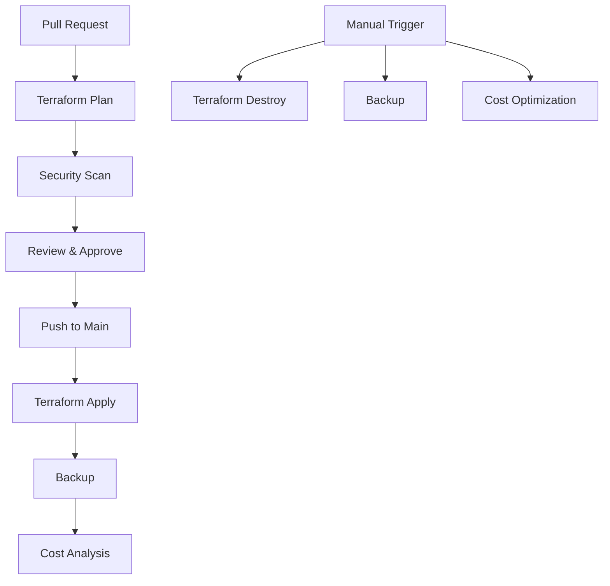

# CI/CD Workflows for Azure App Service Architecture

This directory contains GitHub Actions workflows for automated infrastructure management, security scanning, cost optimization, and backup operations.

## 🚀 Available Workflows

### 1. Terraform Plan (`terraform-plan.yml`)
**Trigger**: Pull requests to `main` or `develop` branches
**Purpose**: Validates Terraform configuration and shows planned changes

**Features**:
- Terraform format checking
- Configuration validation
- Plan generation with detailed output
- PR comments with plan results
- Artifact upload for plan files

### 2. Terraform Apply (`terraform-apply.yml`)
**Trigger**: Push to `main` branch or manual dispatch
**Purpose**: Deploys infrastructure changes to Azure

**Features**:
- Environment-specific deployments
- Manual approval for production
- Deployment status updates
- Output collection and reporting
- State file backup

### 3. Terraform Destroy (`terraform-destroy.yml`)
**Trigger**: Manual dispatch only
**Purpose**: Safely destroys infrastructure resources

**Features**:
- Confirmation requirement (type "DESTROY")
- Environment-specific destruction
- Safety checks and validation
- Cleanup of related artifacts

### 4. Security Scan (`security-scan.yml`)
**Trigger**: Push/PR to main branches, weekly schedule
**Purpose**: Scans infrastructure code for security vulnerabilities

**Tools Used**:
- **TFSec**: Terraform-specific security scanner
- **Checkov**: Infrastructure as Code security analysis
- **Trivy**: Vulnerability and misconfiguration scanner

### 5. Cost Optimization (`cost-optimization.yml`)
**Trigger**: Weekly schedule, manual dispatch
**Purpose**: Analyzes costs and provides optimization recommendations

**Features**:
- Resource cost analysis
- Utilization metrics
- Optimization recommendations
- Automated issue creation
- Cost trend analysis

### 6. Backup and Recovery (`backup.yml`)
**Trigger**: Daily schedule, manual dispatch
**Purpose**: Creates backups of infrastructure and data

**Backup Types**:
- **Full**: Complete infrastructure backup
- **Incremental**: Changes since last backup
- **Configuration**: Terraform state and configs only

## 🔧 Setup Requirements

### GitHub Secrets
Configure the following secrets in your repository:

```bash
# Azure Authentication
AZURE_CREDENTIALS='{"clientId":"...","clientSecret":"...","subscriptionId":"...","tenantId":"..."}'

# Terraform Variables
TF_VAR_PROJECT_NAME="azure-app-arch"
TF_VAR_ENVIRONMENT="production"

# Database Access
SQL_ADMIN_PASSWORD="your-sql-admin-password"
```

### Environment Protection Rules
Set up environment protection rules in GitHub:

1. **Production Environment**:
   - Required reviewers
   - Wait timer (optional)
   - Restrict to main branch

2. **Staging Environment**:
   - Required reviewers (optional)
   - Restrict to develop branch

3. **Development Environment**:
   - No restrictions (for testing)

## 📋 Usage Examples

### Deploy to Production
```bash
# Via GitHub UI
1. Go to Actions tab
2. Select "Terraform Apply"
3. Click "Run workflow"
4. Select "production" environment
5. Click "Run workflow"

# Via CLI (if you have GitHub CLI)
gh workflow run terraform-apply.yml -f environment=production
```

### Destroy Development Environment
```bash
# Via GitHub UI
1. Go to Actions tab
2. Select "Terraform Destroy"
3. Click "Run workflow"
4. Select "development" environment
5. Type "DESTROY" in confirmation field
6. Click "Run workflow"
```

### Manual Backup
```bash
# Via GitHub UI
1. Go to Actions tab
2. Select "Backup and Recovery"
3. Click "Run workflow"
4. Select backup type (full/incremental/configuration)
5. Click "Run workflow"
```

## 🔒 Security Features

### Automated Security Scanning
- **TFSec**: Scans for Terraform security issues
- **Checkov**: Infrastructure security analysis
- **Trivy**: Vulnerability scanning
- **SARIF Integration**: Results appear in GitHub Security tab

### Access Control
- Environment-specific permissions
- Manual approval for production
- Confirmation requirements for destructive operations
- Audit trail for all operations

## 💰 Cost Management

### Automated Cost Analysis
- Weekly cost reports
- Resource utilization monitoring
- Optimization recommendations
- Budget alerts and notifications

### Cost Optimization Tips
1. Use Basic App Service plans for development
2. Implement auto-scaling policies
3. Set up resource tagging
4. Monitor unused resources
5. Use reserved instances for predictable workloads

## 🔄 Backup and Recovery

### Backup Strategy
- **Daily**: Automated backups
- **Retention**: 30 days for artifacts, 7 days for local backups
- **Types**: Full, incremental, and configuration-only backups

### Recovery Process
1. Download backup artifacts from GitHub Actions
2. Restore Terraform state
3. Import existing resources if needed
4. Restore database from .bacpac files
5. Verify service functionality

## 📊 Monitoring and Alerting

### Workflow Monitoring
- Success/failure notifications
- Deployment status updates
- Cost optimization alerts
- Security scan results

### Integration Points
- Azure Monitor for infrastructure metrics
- Application Insights for application monitoring
- Log Analytics for centralized logging
- GitHub notifications for workflow status

## 🛠️ Troubleshooting

### Common Issues

1. **Authentication Failures**
   - Verify Azure credentials in secrets
   - Check subscription permissions
   - Ensure service principal has required roles

2. **Terraform State Issues**
   - Verify state file permissions
   - Check for state locks
   - Ensure consistent state across environments

3. **Resource Conflicts**
   - Check for naming conflicts
   - Verify resource group permissions
   - Ensure proper resource dependencies

### Getting Help
- Check workflow logs in GitHub Actions
- Review Terraform plan outputs
- Consult Azure documentation
- Check security scan results in Security tab

## 📈 Best Practices

1. **Always review plans** before applying changes
2. **Use environment protection rules** for production
3. **Monitor costs regularly** and optimize resources
4. **Keep backups current** and test recovery procedures
5. **Review security scans** and address findings promptly
6. **Use descriptive commit messages** for better tracking
7. **Tag resources appropriately** for cost tracking

## 🔄 Workflow Dependencies



## 📝 Contributing

When adding new workflows:
1. Follow the existing naming conventions
2. Include proper error handling
3. Add security scanning steps
4. Document the workflow purpose
5. Test in development environment first
6. Update this README with new workflow information
