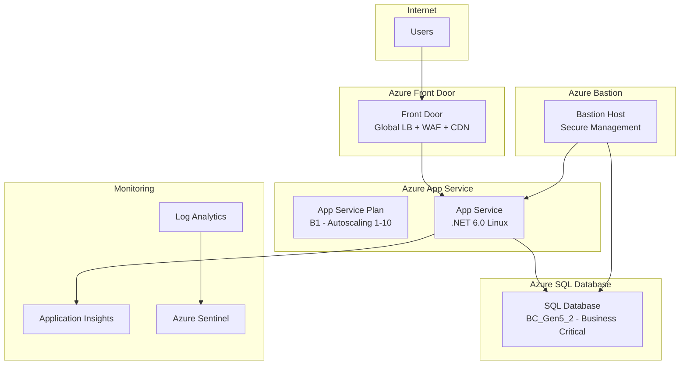

# Azure App Service Architecture - Usage Guide

## 🚀 **How to Use This Infrastructure**

This guide explains how to effectively utilize the deployed Azure App Service Architecture for your applications.

---

## 📋 **Quick Start**

### **1. Access Your Application**
- **Front Door URL**: https://azure-app-arch-prod-fd-endpoint-f9b6cxh4bqeshpce.z01.azurefd.net
- **Direct App Service URL**: https://azure-app-arch-prod-app.azurewebsites.net

### **2. Deploy Your Code**
The infrastructure is already configured with GitHub integration. Here's how to deploy:

```bash
# 1. Fork or clone the sample repository
git clone https://github.com/Azure-Samples/dotnet-core-api.git
cd dotnet-core-api

# 2. Make your changes
# Edit your application code

# 3. Push to trigger deployment
git add .
git commit -m "Deploy my application"
git push origin main
```

---

## 🏗️ **Architecture Overview**



---

## 🔧 **Development Workflow**

### **1. Local Development**

```bash
# Clone your application repository
git clone <your-repo-url>
cd <your-app>

# Install dependencies
dotnet restore

# Run locally
dotnet run

# Test your application
curl http://localhost:5000
```

### **2. Deploy to Azure**

#### **Option A: Automatic Deployment (Recommended)**
```bash
# Push to main branch triggers automatic deployment
git add .
git commit -m "Add new feature"
git push origin main

# Check deployment status in Azure Portal
# Monitor logs in Application Insights
```

#### **Option B: Manual Deployment**
```bash
# Build your application
dotnet publish -c Release -o ./publish

# Deploy using Azure CLI
az webapp deployment source config-zip \
  --resource-group azure-app-arch-prod-rg \
  --name azure-app-arch-prod-app \
  --src ./publish.zip
```

#### **Option C: Using Azure DevOps**
```yaml
# azure-pipelines.yml
trigger:
- main

pool:
  vmImage: 'ubuntu-latest'

steps:
- task: DotNetCoreCLI@2
  inputs:
    command: 'build'
    projects: '**/*.csproj'

- task: DotNetCoreCLI@2
  inputs:
    command: 'publish'
    publishWebProjects: true
    arguments: '--configuration Release --output $(Build.ArtifactStagingDirectory)'

- task: AzureWebApp@1
  inputs:
    azureSubscription: 'your-service-connection'
    appName: 'azure-app-arch-prod-app'
    package: '$(Build.ArtifactStagingDirectory)/**/*.zip'
```

---

## 🗄️ **Database Usage**

### **1. Connection String**
```csharp
// In your appsettings.json or environment variables
{
  "ConnectionStrings": {
    "DefaultConnection": "Server=azure-app-arch-prod-sql.database.windows.net;Database=appdb;User Id=sqladmin;Password=<your-password>;Encrypt=true;TrustServerCertificate=false;Connection Timeout=30;"
  }
}
```

### **2. Database Management**
```bash
# Connect using Azure CLI
az sql db show \
  --name appdb \
  --server azure-app-arch-prod-sql \
  --resource-group azure-app-arch-prod-rg

# Connect using SQL Server Management Studio
# Server: azure-app-arch-prod-sql.database.windows.net
# Database: appdb
# Authentication: SQL Server Authentication
# Username: sqladmin
# Password: <your-password>
```

### **3. Entity Framework Migrations**
```bash
# Add migration
dotnet ef migrations add InitialCreate

# Update database
dotnet ef database update
```

---

## 🔒 **Secure Management Access**

### **1. Access via Azure Bastion**
```bash
# Get Bastion FQDN
az network bastion show \
  --name azure-app-arch-prod-bastion \
  --resource-group azure-app-arch-prod-rg \
  --query "dnsName" -o tsv

# Access: bst-be55365b-773e-4761-899e-fb722e572634.bastion.azure.com
```

### **2. Connect to App Service**
1. Go to Azure Portal
2. Navigate to App Service
3. Click "Bastion" in the left menu
4. Use your Azure credentials to connect

### **3. Connect to SQL Database**
1. Use Bastion to access a VM in the VNet
2. Connect to SQL using SQL Server Management Studio
3. Or use Azure Data Studio

---

## 📊 **Monitoring and Observability**

### **1. Application Insights**
```csharp
// In your Startup.cs or Program.cs
public void ConfigureServices(IServiceCollection services)
{
    services.AddApplicationInsightsTelemetry();
    
    // Custom telemetry
    services.AddSingleton<ITelemetryInitializer, CustomTelemetryInitializer>();
}
```

### **2. Custom Logging**
```csharp
// In your controllers or services
public class WeatherController : ControllerBase
{
    private readonly ILogger<WeatherController> _logger;
    
    public WeatherController(ILogger<WeatherController> logger)
    {
        _logger = logger;
    }
    
    [HttpGet]
    public async Task<IActionResult> Get()
    {
        _logger.LogInformation("Getting weather data");
        
        // Your business logic
        
        _logger.LogInformation("Weather data retrieved successfully");
        return Ok(weatherData);
    }
}
```

### **3. Custom Metrics**
```csharp
// Track custom metrics
public class MetricsService
{
    private readonly TelemetryClient _telemetryClient;
    
    public MetricsService(TelemetryClient telemetryClient)
    {
        _telemetryClient = telemetryClient;
    }
    
    public void TrackCustomMetric(string metricName, double value)
    {
        _telemetryClient.TrackMetric(metricName, value);
    }
}
```

### **4. View Monitoring Data**
- **Application Insights**: Azure Portal > App Service > Application Insights
- **Log Analytics**: Azure Portal > Log Analytics workspaces
- **Metrics**: Azure Portal > App Service > Metrics
- **Alerts**: Azure Portal > Monitor > Alerts

---

## 🔧 **Configuration Management**

### **1. App Settings**
```bash
# Set application settings
az webapp config appsettings set \
  --resource-group azure-app-arch-prod-rg \
  --name azure-app-arch-prod-app \
  --settings \
    "MySetting=MyValue" \
    "ConnectionStrings__DefaultConnection=Server=..." \
    "ASPNETCORE_ENVIRONMENT=Production"
```

### **2. Environment Variables**
```csharp
// In your application
var mySetting = Environment.GetEnvironmentVariable("MySetting");
var connectionString = Configuration.GetConnectionString("DefaultConnection");
```

### **3. Key Vault Integration** (Optional)
```csharp
// Add to Program.cs
builder.Configuration.AddAzureKeyVault(
    new Uri("https://your-keyvault.vault.azure.net/"),
    new DefaultAzureCredential());
```

---

## 🚀 **Scaling and Performance**

### **1. Autoscaling Configuration**
The infrastructure is configured with autoscaling:
- **Min Instances**: 1
- **Max Instances**: 10
- **Scale Out**: CPU > 70% for 5 minutes
- **Scale In**: CPU < 30% for 10 minutes

### **2. Manual Scaling**
```bash
# Scale to specific instance count
az appservice plan update \
  --name azure-app-arch-prod-app-plan \
  --resource-group azure-app-arch-prod-rg \
  --number-of-workers 3
```

### **3. Performance Optimization**
```csharp
// Enable response compression
public void ConfigureServices(IServiceCollection services)
{
    services.AddResponseCompression(options =>
    {
        options.EnableForHttps = true;
    });
}

// Enable caching
public void Configure(IApplicationBuilder app)
{
    app.UseResponseCaching();
    app.UseResponseCompression();
}
```

---

## 🔐 **Security Best Practices**

### **1. HTTPS Only**
```csharp
// Force HTTPS
public void Configure(IApplicationBuilder app)
{
    app.UseHttpsRedirection();
    app.UseHsts();
}
```

### **2. Authentication & Authorization**
```csharp
// Add Azure AD authentication
services.AddAuthentication(JwtBearerDefaults.AuthenticationScheme)
    .AddMicrosoftIdentityWebApi(Configuration.GetSection("AzureAd"));

// Add authorization policies
services.AddAuthorization(options =>
{
    options.AddPolicy("RequireAdminRole", policy =>
        policy.RequireRole("Admin"));
});
```

### **3. CORS Configuration**
```csharp
// Configure CORS
services.AddCors(options =>
{
    options.AddPolicy("AllowFrontDoor", builder =>
        builder.WithOrigins("https://azure-app-arch-prod-fd-endpoint-f9b6cxh4bqeshpce.z01.azurefd.net")
               .AllowAnyMethod()
               .AllowAnyHeader());
});
```

---

## 📱 **API Development**

### **1. RESTful API Example**
```csharp
[ApiController]
[Route("api/[controller]")]
public class ProductsController : ControllerBase
{
    private readonly IProductService _productService;
    private readonly ILogger<ProductsController> _logger;
    
    [HttpGet]
    public async Task<ActionResult<IEnumerable<Product>>> GetProducts()
    {
        _logger.LogInformation("Getting all products");
        var products = await _productService.GetAllAsync();
        return Ok(products);
    }
    
    [HttpGet("{id}")]
    public async Task<ActionResult<Product>> GetProduct(int id)
    {
        _logger.LogInformation("Getting product {ProductId}", id);
        var product = await _productService.GetByIdAsync(id);
        
        if (product == null)
            return NotFound();
            
        return Ok(product);
    }
    
    [HttpPost]
    public async Task<ActionResult<Product>> CreateProduct(Product product)
    {
        _logger.LogInformation("Creating new product");
        var createdProduct = await _productService.CreateAsync(product);
        return CreatedAtAction(nameof(GetProduct), new { id = createdProduct.Id }, createdProduct);
    }
}
```

### **2. Health Checks**
```csharp
// Add health checks
services.AddHealthChecks()
    .AddSqlServer(connectionString)
    .AddAzureKeyVault(keyVaultUri);

// Configure health check endpoint
app.MapHealthChecks("/health");
```

---

## 🔄 **CI/CD Pipeline Usage**

### **1. GitHub Actions**
The repository includes pre-configured GitHub Actions workflows:

- **Terraform Plan**: Validates infrastructure changes on PRs
- **Terraform Apply**: Deploys infrastructure on main branch
- **Security Scan**: Scans for vulnerabilities
- **Infrastructure Test**: Tests deployed infrastructure

### **2. Custom Workflow**
```yaml
# .github/workflows/deploy-app.yml
name: Deploy Application

on:
  push:
    branches: [ main ]
    paths: [ 'src/**' ]

jobs:
  deploy:
    runs-on: ubuntu-latest
    steps:
    - uses: actions/checkout@v4
    
    - name: Setup .NET
      uses: actions/setup-dotnet@v3
      with:
        dotnet-version: '6.0.x'
    
    - name: Build application
      run: dotnet build --configuration Release
    
    - name: Publish application
      run: dotnet publish --configuration Release --output ./publish
    
    - name: Deploy to Azure
      uses: azure/webapps-deploy@v2
      with:
        app-name: 'azure-app-arch-prod-app'
        publish-profile: ${{ secrets.AZUREAPPSERVICE_PUBLISHPROFILE }}
        package: './publish'
```

---

## 🛠️ **Troubleshooting**

### **1. Common Issues**

#### **Application Not Starting**
```bash
# Check application logs
az webapp log tail --name azure-app-arch-prod-app --resource-group azure-app-arch-prod-rg

# Check application settings
az webapp config appsettings list --name azure-app-arch-prod-app --resource-group azure-app-arch-prod-rg
```

#### **Database Connection Issues**
```bash
# Check SQL Server firewall rules
az sql server firewall-rule list --server azure-app-arch-prod-sql --resource-group azure-app-arch-prod-rg

# Test connection
az sql db show --name appdb --server azure-app-arch-prod-sql --resource-group azure-app-arch-prod-rg
```

#### **Front Door Issues**
```bash
# Check Front Door configuration
az cdn profile show --name azure-app-arch-prod-fd --resource-group azure-app-arch-prod-rg

# Check origin health
az cdn origin show --name azure-app-arch-prod-fd-origin --profile-name azure-app-arch-prod-fd --resource-group azure-app-arch-prod-rg
```

### **2. Monitoring Tools**
- **Azure Portal**: Real-time monitoring and diagnostics
- **Application Insights**: Application performance and usage
- **Log Analytics**: Centralized logging and analysis
- **Azure Monitor**: Infrastructure metrics and alerts

---

## 📚 **Next Steps**

### **1. Immediate Actions**
1. **Deploy your application code**
2. **Configure custom domain** (optional)
3. **Set up SSL certificates**
4. **Configure monitoring dashboards**

### **2. Advanced Features**
1. **Enable Azure AD DS** for domain management
2. **Configure Azure Defender** for security
3. **Set up disaster recovery** procedures
4. **Implement backup strategies**

### **3. Optimization**
1. **Performance tuning** based on metrics
2. **Cost optimization** through right-sizing
3. **Security hardening** with additional policies
4. **Monitoring enhancement** with custom dashboards

---

## 🆘 **Support and Resources**

### **Documentation**
- [Azure App Service Documentation](https://docs.microsoft.com/en-us/azure/app-service/)
- [Azure SQL Database Documentation](https://docs.microsoft.com/en-us/azure/azure-sql/)
- [Azure Front Door Documentation](https://docs.microsoft.com/en-us/azure/frontdoor/)

### **Monitoring**
- **Azure Portal**: https://portal.azure.com
- **Application Insights**: Real-time application monitoring
- **Log Analytics**: Centralized log analysis

### **Cost Management**
- **Azure Cost Management**: Monitor and optimize costs
- **Azure Advisor**: Get recommendations for optimization

---

## ✅ **Summary**

This Azure App Service Architecture provides:

- ✅ **Production-ready infrastructure** with high availability
- ✅ **Global distribution** through Azure Front Door
- ✅ **Secure management** via Azure Bastion
- ✅ **Comprehensive monitoring** with Application Insights
- ✅ **Automated scaling** based on demand
- ✅ **CI/CD integration** with GitHub Actions
- ✅ **Database high availability** with Business Critical tier

**Your infrastructure is ready for production workloads!** 🚀
